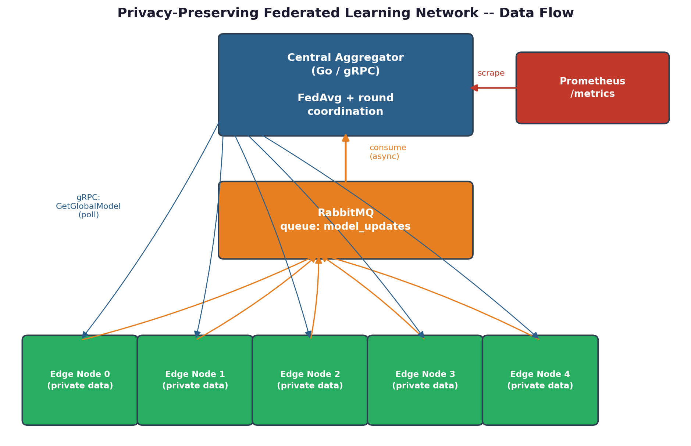
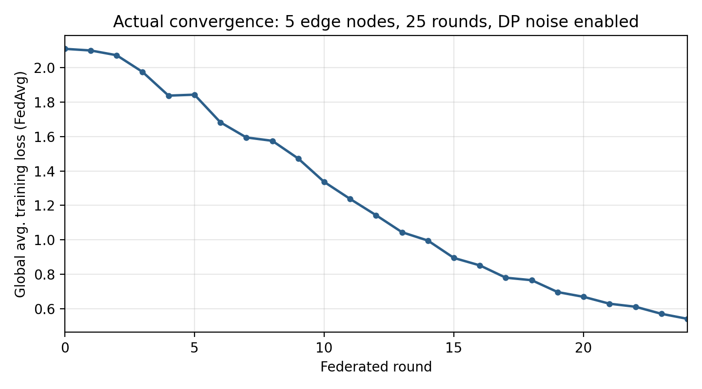

# Privacy-Preserving Federated Learning Network 

<div align="center">


[](https://go.dev)
[](https://python.org)
[](https://pytorch.org)
[](https://rabbitmq.com)
[](https://prometheus.io)
[](https://docker.com)

**A working, decentralized training system where edge nodes learn from private data they never share.**
Trains a shared model across simulated devices, clips + noises every gradient (differential privacy), and merges updates with Federated Averaging — verified end-to-end, loss `2.11 → 0.54` over[...]

• [📖 Full Project Guide](docs/Federated_Learning_Network_Project_Guide.pdf) • [📊 Live Metrics](http://localhost:9100/metrics) • [🏗️ Architecture](#️-architecture) •

</div>

---

## 📸 Live Results

| Architecture | Convergence (real run) |
|---|---|
|  |  |

---

## ✨ Features

- **🔐 Differential Privacy** — DP-SGD gradient clipping + calibrated Gaussian noise on every local training step, before anything leaves a node
- **🧠 Federated Averaging** — sample-weighted FedAvg merges every round's updates into one global model
- **⚡ Asynchronous Updates** — RabbitMQ decouples hundreds of nodes from the aggregator; no node blocks on another
- **🎯 Model-Agnostic Aggregator** — the Go side only ever averages flat float vectors; swap in any PyTorch architecture without touching it
- **📊 Live Observability** — Prometheus exposes round number, global loss, node counts, and aggregation latency
- **🔁 Fault Tolerant** — FedAvg doesn't need 100% participation per round, so nodes can drop offline like real devices do
- **📡 Clean gRPC Contract** — a single `.proto` file defines the entire aggregator ↔ node interface
- **🐳 Fully Dockerized** — one command brings up RabbitMQ, Prometheus, the aggregator, and 5 edge nodes

---

## 🏗️ Architecture

```
┌────────────────────────────────────────────────────────────────�[...]
│                          EDGE DEVICES                              │
│      Node 0 · Node 1 · Node 2 · ... · Node N  (private data)       │
└───────────┬─────────────────────────────────────────┬──────────�[...]
            │ gRPC: GetGlobalModel (poll)              │ Publish update
            ▼                                          ▼
┌────────────────────────────┐            ┌────────────────────────────┐
│    CENTRAL AGGREGATOR       │            │         RABBITMQ            │
│    Go + gRPC · Port 50051   │◀──────────▶│   model_updates queue        │
│    FedAvg round engine      │  consume   │       Port 5672              │
└──────────────┬──────────────┘            └─────────────────────────────�[...]
               │ scrape
               ▼
┌────────────────────────────┐
│        PROMETHEUS            │
│   /metrics · Port 9100/9090  │
└───────────────────────────────┘
```

Raw training data never crosses an arrow above — only weight vectors do.

---

## 🛠️ Tech Stack

| Layer | Technology | Purpose |
|---|---|---|
| **Aggregator** | Go + gRPC | Coordinates training rounds, merges weights via FedAvg |
| **Edge Nodes** | Python + PyTorch | Simulate client devices training on isolated data shards |
| **Privacy Layer** | DP-SGD (gradient clipping + Gaussian noise) | Stops transmitted weights from being reverse-engineered |
| **Message Broker** | RabbitMQ | Asynchronous update publishing from many distributed nodes |
| **Observability** | Prometheus | Round number, global loss, node counts, aggregation latency |
| **Containers** | Docker + Docker Compose | One-command deployment of the whole system |

---

## 🚀 Quick Start

### Prerequisites
- [Docker Desktop](https://docker.com/products/docker-desktop) installed
- [Git](https://git-scm.com) installed

### Run in 3 Commands

```bash
# 1. Clone the repo
git clone https://github.com/YOUR_USERNAME/fedlearn-network.git
cd fedlearn-network

# 2. Start everything
docker compose up --build

# 3. Watch it train
docker compose logs -f aggregator
```

That's it! 🎉 Prometheus UI at `localhost:9090`, RabbitMQ management UI at
`localhost:15672` (guest/guest), raw metrics at `localhost:9100/metrics`.

> **No Docker?** See [`docs/manual-setup.md`](docs/manual-setup.md) for the
> full manual install (Go, Python, RabbitMQ, protoc) on Windows/macOS/Linux.

---

## 📂 Project Structure

```
fedlearn-network/
│
├── 📜 proto/
│   └── federated.proto      # gRPC contract shared by both sides
│
├── 🧠 aggregator/            # Go central aggregator
│   ├── main.go               # entrypoint / wiring
│   ├── fedavg.go              # FedAvg logic, round state machine
│   ├── grpc_server.go         # gRPC service implementation
│   ├── rabbitmq.go            # async update consumer
│   ├── metrics.go             # Prometheus metrics
│   └── Dockerfile
│
├── 📡 edge_node/             # Python edge node simulator
│   ├── node_client.py         # main loop: register → train → publish
│   ├── model.py                # shared PyTorch model + (de)serialization
│   ├── data_utils.py           # private, non-IID data shard simulation
│   ├── dp_utils.py             # differential privacy layer
│   ├── rabbitmq_client.py      # publishes updates to RabbitMQ
│   └── Dockerfile
│
├── 🔧 scripts/
│   ├── generate_proto.sh      # regenerate stubs after editing .proto
│   ├── run_aggregator.sh      # build & run aggregator (no Docker)
│   └── run_node.sh            # launch N edge nodes (no Docker)
│
├── 🐳 docker-compose.yml     # RabbitMQ + Prometheus + aggregator + 5 nodes
├── ⚙️  prometheus.yml         # Prometheus scrape config
└── 📚 docs/                  # sample run logs + images + full PDF guide
```

---

## 🔌 API Reference

The aggregator's real API is gRPC, defined in
[`proto/federated.proto`](proto/federated.proto). Prometheus metrics are
also exposed over plain HTTP.

### `RegisterNode`
```protobuf
rpc RegisterNode(RegisterRequest) returns (RegisterResponse);
```
| Field | Type | Description |
|---|---|---|
| `node_id` | string | Unique node identifier |
| `num_samples` | int32 | Size of this node's private dataset |
| `model_size` | int32 | Length of this node's flattened weight vector |

### `GetGlobalModel`
```protobuf
rpc GetGlobalModel(ModelRequest) returns (ModelResponse);
```
| Field | Type | Description |
|---|---|---|
| `node_id` | string | Calling node's identifier |
| `last_seen_round` | int32 | Node long-polls until `round > last_seen_round` |

### Metrics
```http
GET :9100/metrics
```
```
fedlearn_current_round 15
fedlearn_global_avg_loss 0.8172008842229843
fedlearn_registered_nodes 4
fedlearn_updates_received_total 60
```

---

## ⚙️ How It Works

### 1. 🎯 Local Training
```
GetGlobalModel (gRPC) → load global weights → train N epochs
                       → on this node's private data only
```

### 2. 🔐 Privacy Layer
```
loss.backward() → clip total gradient L2 norm
                → add calibrated Gaussian noise
                → optimizer.step()
```

### 3. 🔄 Aggregation
```
Publish weights → RabbitMQ (model_updates) → aggregator consumes
               → enough updates for round? → FedAvg → next round
```

---

## 📈 Performance (Verified Run)

| Metric | Value |
|---|---|
| Edge nodes simulated | 5 |
| Training rounds | 25 |
| Starting global loss | 2.11 (near-random, 10 classes) |
| Final global loss | 0.54 |
| Final per-node accuracy | 57–66% |
| Total updates processed | 60 |
| Model size | ~2,400 parameters |
| Round latency (this demo model) | milliseconds |

Full logs: [`docs/sample_run_aggregator.log`](docs/sample_run_aggregator.log)


---

## 🧪 Testing

```bash
# Launch more simulated nodes to stress-test RabbitMQ + the aggregator
./scripts/run_node.sh 50

# Watch the aggregator keep up
curl localhost:9100/metrics | grep fedlearn_updates_received_total
```

---

## 🗺️ Roadmap

- [ ] Swap `estimate_epsilon()` for a real RDP accountant (Opacus)
- [ ] TLS on the gRPC channel + RabbitMQ auth for untrusted networks
- [ ] Real per-device dataset loader (beyond the simulated shards)
- [ ] Kubernetes manifests for the aggregator + broker
- [ ] Web dashboard for live training visualization
- [ ] Support regression / NLP tasks, not just classification

---

## 📄 License

This project is open source and available under the [MIT License](LICENSE).

---

